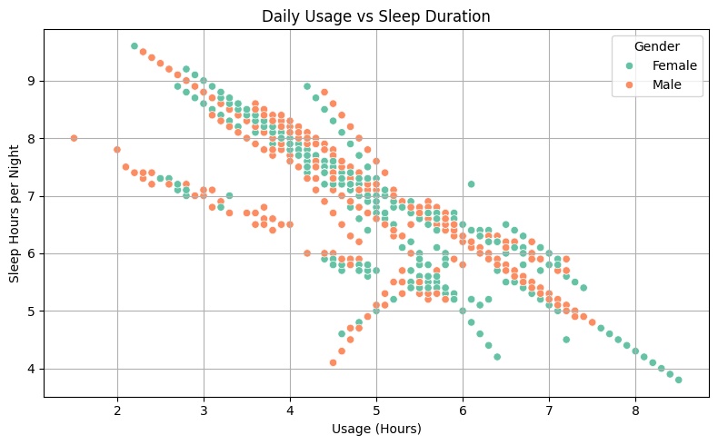

# 📊 Students' Social Media Impact – Exploratory Data Analysis

> A deep dive into how social media usage influences students’ mental health, sleep quality, academic performance, and personal relationships – based on real survey data.


  
[](students_social_media_impact_EDA.ipynb) 
[](https://www.kaggle.com/datasets/adilshamim8/social-media-addiction-vs-relationships)

---

## 📖 Project Overview

This EDA explores how **daily time spent** on social media affects **mental well-being, sleep patterns, academic results**, and **relationships** of students aged 16–25.

📊 **Sample size**: 705 students  
🌍 **Countries covered**: India, USA, Canada, France, Mexico, and more  
📅 **Period**: Q1 2025  
📋 **Variables**: Usage hours, sleep hours, mental health scores, addiction score, academic impact, relationship status, platform preference, etc.

---

## 📚 Table of Contents

- [📖 Project Overview](#-project-overview)
- [🎯 Key Questions Answered](#-key-questions-answered)
- [🛠️ Methodology](#️-methodology)
- [📈 Core Findings](#-core-findings)
  - [✅ Usage Patterns](#-usage-patterns)
  - [🧠 Mental Health vs Usage](#-mental-health-vs-usage)
  - [😴 Sleep Duration](#-sleep-duration)
  - [🔁 Sleep vs Mental Health](#-sleep-vs-mental-health)
  - [🎓 Academic Impact](#-academic-impact)
  - [💔 Relationship & Conflict](#-relationship--conflict)
  - [📱 Platform-wise Addiction](#-platform-wise-addiction)
  - [📊 Demographic & Platform Preferences](#-demographic--platform-preferences)
- [📊 Correlation Matrix](#-correlation-matrix)
- [📌 Key Takeaways](#-key-takeaways)
- [💡 Suggested Actions](#-suggested-actions)
- [📌 Conclusion](#-conclusion)
- [🧪 How to Run This Project](#-how-to-run-this-project)
- [🧠 Project Structure](#-project-structure)

---

## 🎯 Key Questions Answered

1. Does social media impact **mental health** or **sleep**?
2. Is high usage linked to **lower academic performance**?
3. Which platforms are most **addictive** or lead to **conflicts**?
4. How do preferences vary by **age, gender, and country**?
5. Do students in **relationships** experience fewer social issues?

---

## 🛠️ Methodology

- Data loading and cleaning with **pandas**
- Visualization with **seaborn** and **matplotlib**
- Correlation and pattern detection
- Insight-driven interpretation

---

## 📈 Core Findings

### ✅ Usage Patterns
- Average time spent: **4.92 hours/day**
- Peak users: **up to 8.5 hours/day**


---

### 🧠 Mental Health vs Usage

- Usage <3 hrs → Mental health scores: **7–9**
- Usage >5 hrs → Scores drop to **<5**


---

### 😴 Sleep Duration

- Light users sleep **7–8 hours**
- Heavy users (6–7+ hrs on SM) → **<5 hours sleep**



---

### 🔁 Sleep vs Mental Health


---

### 🎓 Academic Impact

- 56% say social media **hurts academic performance**
- Heavy users (5.1 hrs/day) more affected than light users

|                                       |                                   |
|---------------------------------------|-----------------------------------|
|  |  |

---

### 💔 Relationship & Conflict

- **Single students**: ~3.1 conflicts/month  
- **In relationships**: ~1.9 conflicts/month

|                                       |                                   |
|---------------------------------------|-----------------------------------|
|  |  |

---

### 📱 Platform-wise Addiction

- **Instagram** has highest addiction score (**7.2/10**)
- TikTok and Twitter follow closely


---

### 📊 Demographic & Platform Preferences

|                                       |                                   |
|---------------------------------------|-----------------------------------|
|  |  |
|  |  |
|  |  |
|  |  |

---

## 📊 Correlation Matrix

```plaintext
Avg_Daily_Usage_Hours   -0.62  →  Mental_Health_Score
Avg_Daily_Usage_Hours   -0.55  →  Sleep_Hours_Per_Night
Sleep_Hours_Per_Night   +0.43  →  Mental_Health_Score
```

🧠 → More screen time = ↓ sleep = ↓ mental health  
🔁 A clear **negative feedback loop**

---

## 📌 Key Takeaways

- Students using social media **>5 hours/day** show significant drops in **mental and academic performance**
- Sleep quality is compromised beyond **6 hours/day of usage**
- Instagram shows the **highest addiction score**
- Students in relationships have **fewer social conflicts**

---

## 💡 Suggested Actions

- Set daily screen-time limits: **3–4 hours max**
- Raise awareness of Instagram’s addictive potential
- Prioritize sleep hygiene for student mental health
- Encourage relationship support via digital boundaries

---

## 📌 Conclusion

This EDA demonstrates a strong relationship between excessive social media use and negative outcomes across mental health, sleep, and academics. The **4–5 hour/day** range appears critical — beyond this threshold, adverse effects increase significantly.

> **Actionable Insight**: Reducing usage to **under 4 hours/day**, especially on highly addictive platforms like Instagram, can improve well-being and academic outcomes for students.

---

## 🧪 How to Run This Project

### 1. Clone this repo
```bash
git clone https://github.com/your-username/Students-Social-Media-Impact-EDA.git
cd Students-Social-Media-Impact-EDA
```

### 2. Install dependencies
```bash
pip install pandas matplotlib seaborn numpy
```

### 3. Download the dataset  
Place the `.csv` inside the `dataset/` folder.

```
dataset/
└── students_social_media_data.csv
```

### 4. Launch the notebook
```bash
jupyter notebook students_social_media_impact_EDA.ipynb
```

---

## 🧠 Project Structure

```plaintext
Students-Social-Media-Impact-EDA/
│
├── README.md
├── students_social_media_impact_EDA.ipynb
├── dataset/
│   └── students_social_media_data.csv
└── visualizations/
    ├── 1.1_gender_distribution.png
    ├── 1.2_academic_level_distribution.png
    ├── 1.3_age_distribution.png
    ├── 1.4_top_countries.png
    ├── 2.1_time_spent.png
    ├── 2.2_platform_usage.png
    ├── 3.1_daily_usage_mental_health.png
    ├── 3.2_daily_usage_sleep_duration.png
    ├── 3.3_usage_sleep_mental_health.png
    ├── 4.1_academic_impact_usage.png
    ├── 4.2_academic_impact_perception.png
    ├── 4.3_usage_time_academic_impact.png
    ├── 5.1_addiction_score_platform.png
    ├── 5.2_conflicts_relationship_status.png
    ├── 5.3_addiction_score_conflicts.png
    ├── 6.1_platform_gender.png
    ├── 6.2_platform_age.png
    └── 6.3_platform_country.png
```

---
