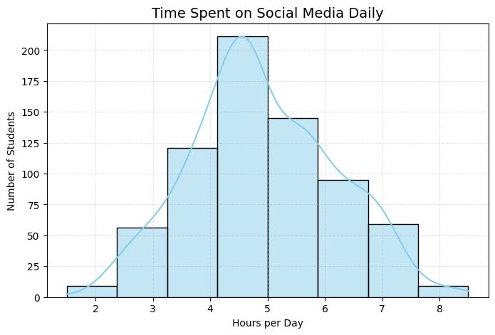

# Students' Social Media Impact – An Exploration

This exploratory data analysis (EDA) looks closely at how students' daily social media use affects their mental well-being, sleep, school performance, and relationships. It's based on survey information from real students.


  
[](students_social_media_impact_EDA.ipynb) 
[](https://www.kaggle.com/datasets/adilshamim8/social-media-addiction-vs-relationships)

---

## Index

1. [Project Overview](#project-overview)
2. [How to Run This Project](#how-to-run-this-project)
3. [What This Study Aimed to Discover](#what-this-study-aimed-to-discover)
4. [How This Study Was Conducted](#how-this-study-was-conducted)
5. [Key Discoveries](#key-discoveries)
6. [Important Points to Remember](#important-points-to-remember)
7. [What Can Be Done](#what-can-be-done)
8. [Final Thoughts](#final-thoughts)

---

## Project Overview

This study explores how the time students spend on social media each day influences their overall well-being. The focus was on students aged 16 to 25.

*   **Number of Students Surveyed**: 705
*   **Countries Included**: Students from various countries like India, USA, Canada, France, and Mexico.
*   **Survey Period**: Early 2025 (First three months)
*   **Information Collected**: Details like how many hours they use social media, how many hours they sleep, their mental health scores, how addicted they feel to social media, if it affects their schoolwork, their relationship status, and which platforms they use most.

---

## How to Run This Project

### 1. Get the Project Files

Open your terminal or command prompt and type:
```bash
git clone https://github.com/cshuvam/students_social_media_impact_analysis.git
cd students_social_media_impact_analysis
```

### 2. Install Necessary Tools

Make sure you have Python installed. Then, install the required libraries:
```bash
pip install pandas matplotlib seaborn numpy
```

### 3. Get the Data

Download the `students_social_media_data.csv` file and place it inside the `dataset/` folder. Your project structure should look like this:

```
students_social_media_impact_analysis/
│
├── README.md
├── students_social_media_impact_EDA.ipynb
├── dataset/
│   └── students_social_media_data.csv
└── visualizations/
    ├── 1.1_gender_distribution.png
    ├── ... (other image files)
```

### 4. Open the Study Notebook

In your terminal or command prompt, run:
```bash
jupyter notebook students_social_media_impact_EDA.ipynb
```
This will open the project in your web browser, where you can see all the analysis and charts.

---

## What This Study Aimed to Discover

1.  Does using social media a lot affect students' mental health or how much they sleep?
2.  Is spending a lot of time on social media linked to lower grades in school?
3.  Which social media platforms seem to be the most habit-forming or cause the most arguments?
4.  Do students of different ages, genders, or from different countries prefer certain social media platforms?
5.  Do students who are in relationships have more arguments because of social media compared to others?

---

## How This Study Was Conducted

*   Data was loaded and cleaned using a tool called **pandas**.
*   Charts and graphs were created to visualize patterns in the data using **seaborn** and **matplotlib**.
*   Connections and trends in the information were identified.
*   The findings from the data were explained in simple terms.

---

## Key Discoveries

### How Much Time Students Spend Online

*   On average, students spend about **5 hours a day** on social media.
*   Some students were found to spend as much as **8.5 hours a day** online.



**The above chart shows how many hours students spend on social media each day. Most students fall into the 4-5 hours per day range.**

---

### Social Media Use and Mental Health

*   A clear link was found: the more time students spend on social media, the lower their mental health scores tend to be.
*   Students using social media for **more than 5 hours a day** generally reported **lower mental health scores** (5 or less out of 10).
*   Students who used social media for **less than 3 hours a day** usually had **higher mental health scores** (7 to 9 out of 10).


**The above chart illustrates the relationship between daily social media usage and mental health scores. It indicates that higher usage is associated with lower mental health scores.**

---

### Social Media Use and Sleep

*   A noticeable connection was observed: more social media use often means less sleep.
*   Students who are **heavy users** (6-7 or more hours a day) often sleep **less than 5 hours** per night.
*   **Light users** (3 hours or less a day) typically get a healthy **7-8 hours of sleep**.


**The above chart displays how daily social media usage affects sleep duration. A downward trend suggests that increased social media time correlates with fewer hours of sleep.**

---

### The Link Between Usage, Sleep, and Mental Health

*   The analysis showed that more social media use is connected to less sleep, and less sleep is connected to poorer mental health. This suggests a cycle where heavy social media use can negatively affect both sleep and mental well-being.


**The above heatmap shows the correlation between social media usage, sleep hours, and mental health scores. Negative numbers indicate that as one factor increases, the other tends to decrease.**

---

### Impact on School Performance

*   A majority of students (56%) believe that social media **negatively affects their schoolwork**.
*   Students who felt their grades were impacted spent more time on social media, averaging about **5.1 hours a day**, compared to those who didn't feel an impact, who averaged **4.2 hours a day**.

|                                       |                                   |
|---------------------------------------|-----------------------------------|
|  |  |
| The left chart compares average daily social media usage based on whether students believe it affects their academic performance. | The right chart shows the percentage of students who perceive an academic impact from social media. |

---

### Arguments and Relationships

*   **Single students** reported having the **most arguments** related to social media (around 3 arguments per month).
*   Students **in relationships** had **fewer arguments** (about 2 arguments per month).
*   It was also found that students who had more arguments tended to have higher addiction scores, suggesting a link between conflicts and how much they feel addicted to social media.

|                                       |                                   |
|---------------------------------------|-----------------------------------|
|  |  |
| The left chart breaks down the number of social media conflicts by relationship status. | The right chart illustrates how addiction scores vary with the frequency of conflicts over social media. | 

---

### Which Platforms Are Most Habit-Forming?

*   **Instagram** users reported the **highest average addiction score** (around 7 out of 10).
*   **TikTok** and **Twitter** also had high addiction scores, but with a wider range of responses.
*   Platforms like **LinkedIn** and **YouTube** generally had **lower average addiction scores**.


**The above chart displays the distribution of addiction scores across different social media platforms, highlighting which platforms are associated with higher self-reported addiction levels.**

---

### Who Uses Which Platforms?

*   **Gender**: **Female students** strongly preferred **Instagram**. **Male students** leaned more towards **TikTok**, **WhatsApp**, and **Twitter**. **Facebook** and **Snapchat** were used almost equally by both genders.
*   **Age**: **Younger students** (around 21 years old) were more drawn to **Instagram**, **TikTok**, and **Snapchat**. **Older students** (23 years and above) preferred **LinkedIn**, **Facebook**, and **WhatsApp**.
*   **Country**: **Instagram** was very popular in **India** and the **USA**. **TikTok** was a top choice in **Canada**, while **Facebook** had a strong user base in **France**.

|                                       |                                   |
|---------------------------------------|-----------------------------------|
|  |  |
|  |  |
|  |  |
|  |  |

**These charts provide a demographic breakdown of the surveyed students and their social media platform preferences based on gender, age, and country.**

---

## Important Points to Remember

*   It was found that students who use social media for **more than 5 hours a day** often experience significant problems with their mental health and school performance.
*   Sleeping less than **6 hours a night** is often connected to heavy social media use.
*   **Instagram** appears to be the most habit-forming platform among students.
*   Single students tend to have more arguments related to social media.

---

## What Can Be Done

**For Students:**
*   It is recommended to **limit social media use, especially before bed**, to help improve sleep and mental well-being.
*   Consider using **apps that track screen time** to help manage how much time is spent on platforms like Instagram and TikTok, which can be very engaging.

**For Parents and Teachers:**
*   It is suggested to discuss the potential downsides of **Instagram** and **TikTok** with students, as these platforms show higher addiction levels in this study.
*   Helping students set **healthy boundaries** for social media use is encouraged, particularly if their schoolwork is suffering.

**For Decision-Makers:**
*   Programs that promote **healthy digital habits** should be created, keeping in mind that preferences vary by age, gender, and country.
*   Support for mental health should prioritize **heavy social media users**, as they are more likely to experience negative effects.

---

## Final Thoughts

- This study clearly shows that using social media too much can lead to less sleep, poorer mental health, difficulties in school, and more arguments for students. 
- The period of **4-5 hours of daily use** seems to be a crucial point; going beyond this often leads to more negative effects.
- **The main advice from this study is**: If students can reduce their social media use to **under 4 hours a day**, especially on platforms like Instagram, it could significantly improve their overall well-being and academic success.

---
